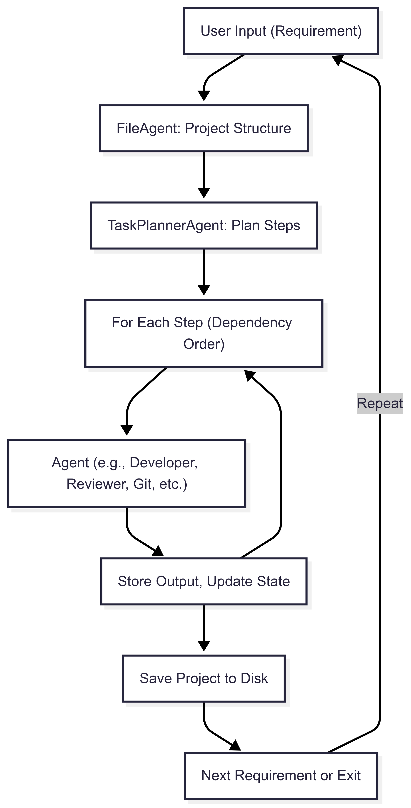

# Clan: Agentic Orchestration Framework

Clan is an agentic orchestration framework for software engineering automation. It leverages LLM-powered agents to plan, generate, review, and test code and documentation, enabling dynamic and extensible workflows for building and evolving software projects.


## Key Features
- Modular, extensible agent system (DeveloperAgent, TaskPlannerAgent, etc.)
- Step-by-step, context-aware project planning and execution
- Unified agent for generating and updating all types of files (code, docs, configs, etc.)
- Interactive CLI with project summary-driven suggestions
- Multi-language support and easy extensibility

## Orchestration Diagram



## Available Agents

- **DeveloperAgent**: Generates and updates code, documentation, and configuration files.
- **UnitTesterAgent**: Writes and runs unit tests for code files.
- **CodeReviewerAgent**: Reviews code for quality, style, and correctness.
- **SummaryAgent**: Summarizes project state and changes.
- **TaskPlannerAgent**: Plans step-by-step implementation for requirements.
- **FileAgent**: Designs and manages project structure.
- **CommandRunnerAgent**: Generates shell commands for automation.
- **GrepSearchAgent**: Generates grep commands for codebase/file search.
- **GitAgent**: Generates git commands for version control operations.

## Example Usage

```bash
python -m clan.main
```
You will be prompted to enter the programming language (default: Python) and your project requirement (e.g., "Implement a queue in Python").

## Requirements
- Python 3.8+
- `python-dotenv` (for environment variable management)
- For OpenAI: `openai` Python package (if using OpenAI provider)
- For Ollama: [Ollama](https://ollama.com/) running locally

Install dependencies:
```bash
pip install -r requirements.txt
```

## LLM Provider Setup
Clan supports multiple LLM providers (e.g., OpenAI, Ollama). Set the appropriate environment variables in a `.env` file or your shell:

### For Ollama (local LLM)
- `PROVIDER=ollama`
- `OLLAMA_ENDPOINT=http://localhost:11434/api/generate/` (default)
- `OLLAMA_MODEL=llama2` (or your preferred model)

Start Ollama locally and pull a model:
```bash
ollama pull llama2
ollama serve
```

### For OpenAI
- `PROVIDER=openai`
- `OPENAI_API_KEY=your_openai_api_key`

### For MCP (if supported)
- `PROVIDER=mcp`
- `MCP_ENDPOINT=your_mcp_endpoint`
- `MCP_API_KEY=your_mcp_api_key`

## Extending or Customizing Agents
- To add a new agent, create a new agent class inheriting from `BaseAgent` and register it in `data/agent_info.yaml`.
- Implement the agent's logic in its `act` method.
- Add the agent to the orchestrator registry if needed.
- Update the plan schema or TaskPlannerAgent prompt if your agent requires new fields.

## Troubleshooting
- **KeyError: 'code_reviewer'**: Ensure your config (e.g., `PROMPT_TEMPLATES`) includes a `code_reviewer` key and is passed to all agent factories.
- **ModuleNotFoundError/AttributeError**: Make sure agent class names in `data/agent_info.yaml` match the actual class names in your codebase.
- **LLM API errors**: Check your environment variables and API keys for the selected provider.
- **Shell command errors**: Ensure the correct shell is installed and available on your system (e.g., bash, git bash, powershell).

## Notes
- The orchestrator is interactive and will guide you through entering requirements and next steps.
- Generated projects are saved in the `projects/` directory.
- You can extend or customize agents and workflows as needed.

---

## Pre-Push Checklist

Before pushing to GitHub, make sure you:
- [ ] Run all tests and a sample workflow to ensure there are no runtime errors.
- [ ] Check for leftover debug prints or TODOs in the code.
- [ ] Ensure README.md is up to date and describes the new architecture and usage.
- [ ] Ensure requirements.txt includes all necessary dependencies.
- [ ] Ensure .gitignore is set up to exclude unnecessary files (e.g., __pycache__, .env, .vscode, projects/).
- [ ] Ensure no large or sensitive files (e.g., .env with real keys) are present in the repo.
- [ ] Optionally, write a release note or PR description summarizing the milestone.

---

**Contributions and feedback are welcome!** 